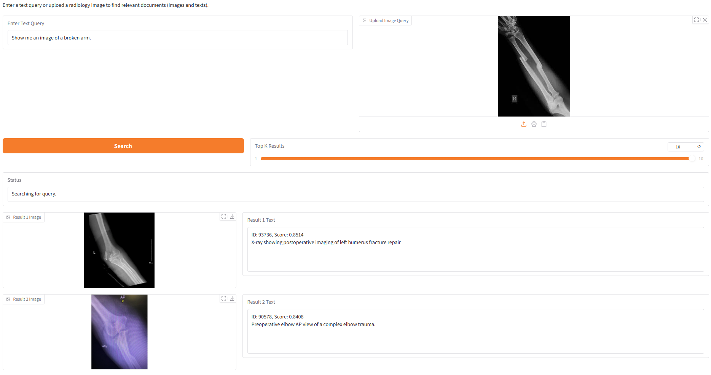

# Multimoda Retrieval

## 🛠️ Environment Setup

```bash
pip install -r requirements.txt
```


## 📁Dataset
This project uses datasets from the 🤗 Hugging Face Hub.

The dataset is automatically downloaded using the `datasets` library.

### Example

```python
from datasets import load_dataset

dataset = load_dataset("Jiiwonn/roco2-question-id-dataset")
```

## 🚀 Train
```python
python3 train.py \
  --pretrained_clip_model_dir ViT-L/14 \
  --batch_size 32 \
  --merge weight \
  --epochs 10
```

## 🧪 Environment

### Embedding Faiss index
```python
python3 src/embedder.py \
  --merge weight \
  --ckpt_name vit-l-14/weight/_epoch_10.pth
```
#### Index path: myproject/embedding/test/ckpt_name/

### Evaluation
```python
python3 src/retriever.py \
  --ckpt_name vit-l-14/weight/_epoch_10.pth
```
#### Result path: myproject/ckpt_name/final_tsv/evalutaion_results_{data}.tsv

## 🚀 Run a Demo

```python
python3 demo.py \
  --pretrained_clip_model_dir ViT-L/14 \
  --merge weight \
  --ckpt_name vit-l-14/weight/_epoch_10.pth
```
